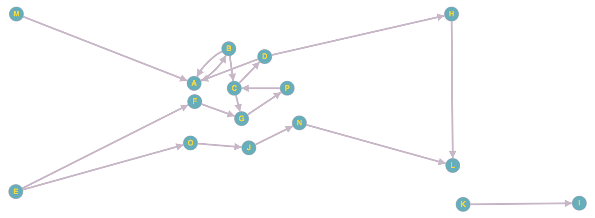
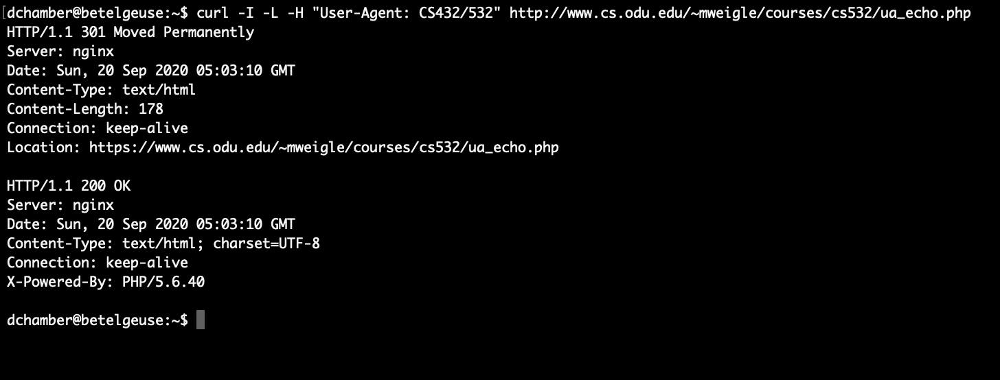
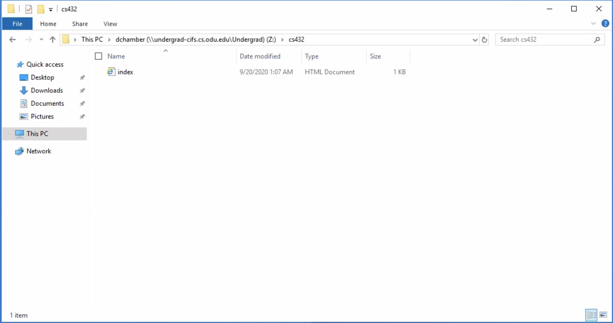
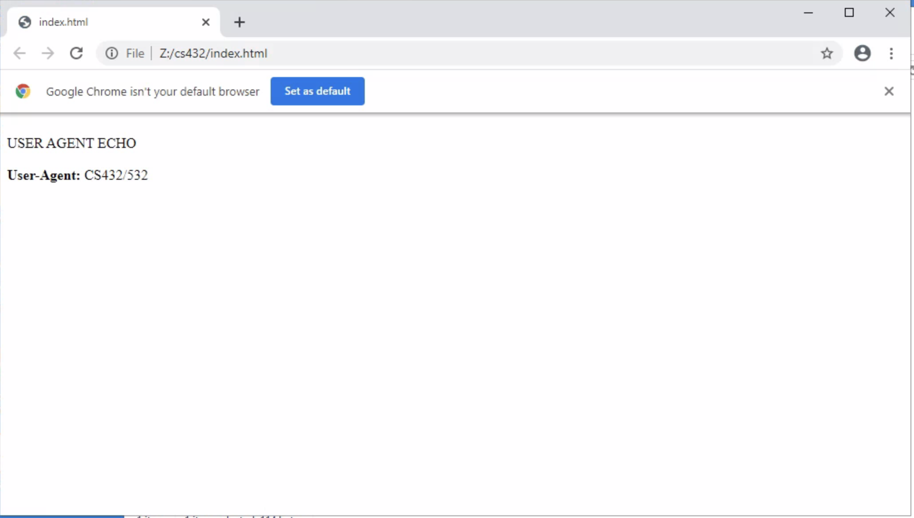
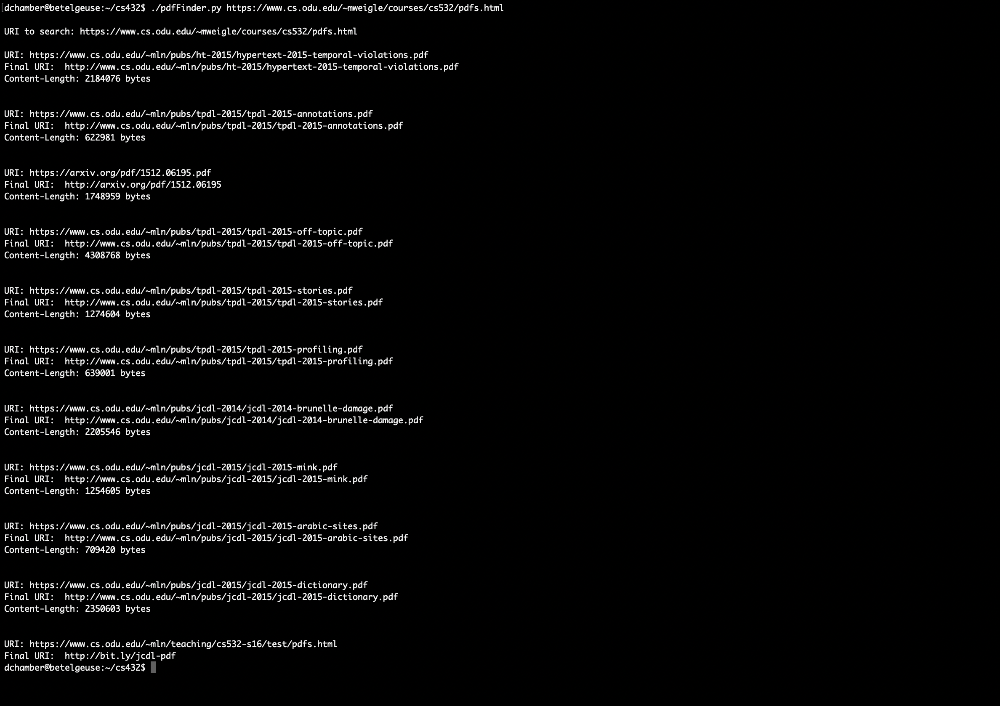
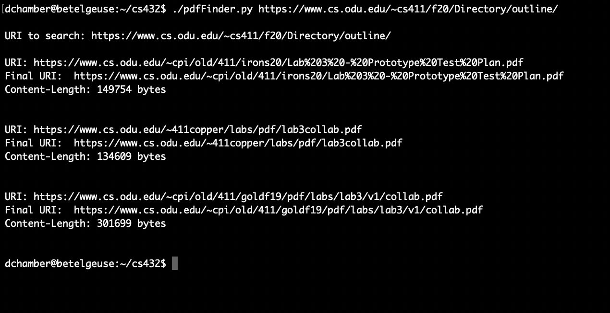
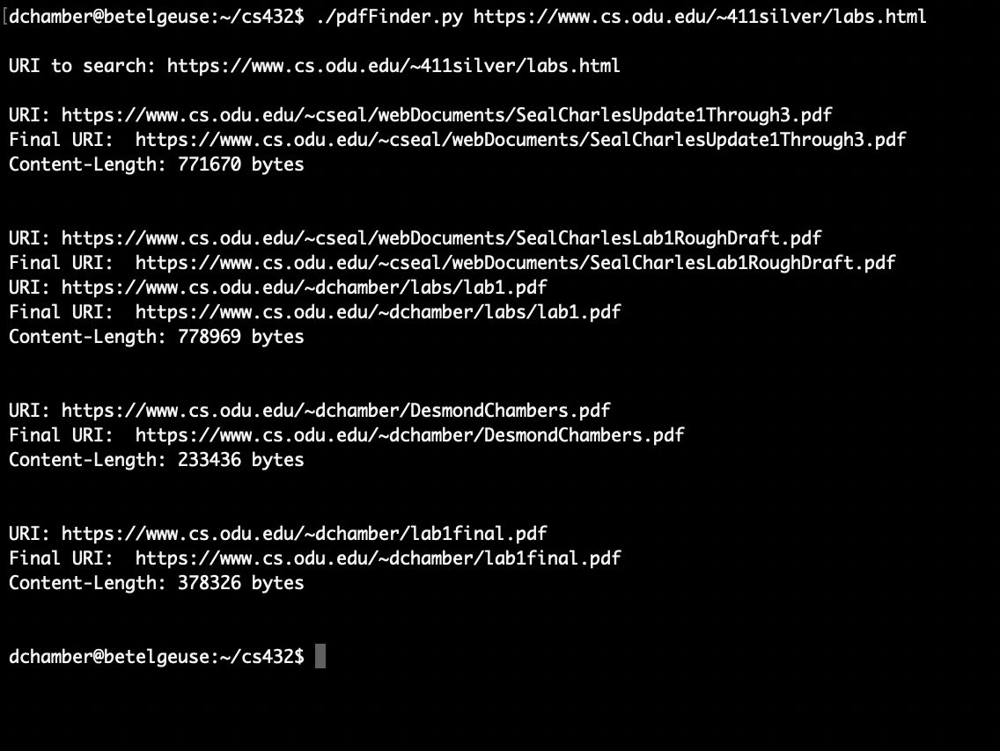

# Desmond Chambers - HW1
### Q1
Consider the "bow-tie" structure of the web in the Broder et al. paper (http://snap.stanford.edu/class/cs224w-readings/broder00bowtie.pdf) that was described in Week 1. 

Now consider the following links:

    A --> B
    B --> A
    B --> C
    C --> D
    C --> G
    D --> A
    D --> H
    E --> F
    E --> O
    F --> G
    G --> P
    H --> L
    J --> N
    K --> I
    M --> A
    N --> L
    O --> J
    P --> C

Draw the resulting graph (either sketch on paper or use another tool) and include an image in your report.



For the above graph, list the nodes (in alphabetical order) that are each of the following categories:
* IN: 
    * M
    * E
* SCC: 
    * A
    * B
    * C
    * D
    * F
    * G
    * P

* OUT: 
    * H
    * L
* Tendrils: 
    * indicate if the tendril is reachable from IN or can reach OUT
        * This graph seem not to have any tendrils.
* Tubes: 
    * explain how the nodes serve as tubes
        * O
        * N
        * J
        * All the nodes listed above created a path from IN to OUT
    
* Disconnected:
    * I
    * K
    
    
### Q2
Demonstrate that you know how to use `curl` and are familiar with the available options.

URI to request: http://www.cs.odu.edu/~mweigle/courses/cs532/ua_echo.php

a) In a single `curl` command, request the URI, show the HTTP response headers, follow any redirects, and change the User-Agent HTTP request field to "CS432/532".  Show command you used and the result of your execution on the command line.  (Either take a screenshot of your terminal or copy/paste into a code segment.)



b) Then make the same request again, but without showing the HTTP response headers and with saving the HTML output to a file.  Show the command you used and the result of your execution on the command line. View that file in a browser and take a screenshot.



c) Finally, load the URI directly from your browser and take a screenshot.



Explain the results you get for each of these steps.
The first query returned the header then was redirected to a https website and recieved a 200 ok messeage. The second followed the redirect and download the content to html file with the User-Agent HTTP request field changed to "CS432/532".

### Q3
Write a Python program to find links to PDFs in a webpage.

Your program must do the following:
* take the URI of a webpage as a command-line argument
* extract all the links from the page
* for each link, use the `Content-Type` HTTP response header to determine if the link references a PDF file
* for all links that reference a PDF file, print the original URI (found in the source of the original HTML), the final URI (after any redirects), and the number of bytes in the PDF file. (Hint: `Content-Length` HTTP response header)

Show that the program works on 3 different URIs, one of which must be https://www.cs.odu.edu/~mweigle/courses/cs532/pdfs.html

* https://www.cs.odu.edu/~mweigle/courses/cs532/pdfs.html 



* https://www.cs.odu.edu/~cs411/f20/Directory/outline/



* https://www.cs.odu.edu/~411silver/labs.html



## Python code

* [pdfFinder.py](./pdfFinder.py)


Here is a snippet of the expected operation:

```
% python3 findPDFs.py https://www.cs.odu.edu/~mweigle/courses/cs532/pdfs.html

URI: http://www.cs.odu.edu/~mln/pubs/ht-2015/hypertext-2015-temporal-violations.pdf
Final URI: https://www.cs.odu.edu/~mln/pubs/ht-2015/hypertext-2015-temporal-violations.pdf
Content Length: 2,184,076 bytes

URI: http://www.cs.odu.edu/~mln/pubs/tpdl-2015/tpdl-2015-annotations.pdf
Final URI: https://www.cs.odu.edu/~mln/pubs/tpdl-2015/tpdl-2015-annotations.pdf
Content Length: 622,981 bytes
```

## Submission

Make sure that you have committed and pushed your local repo to GitHub.  Your repo should contain any code you developed to answer the questions.  Include "Ready to grade @weiglemc @brutushammerfist" in your final commit message. 

Submit the URL of your *report* in Blackboard:

* Click on HW1 under Week 2 in Blackboard
* Under "Assignment Submission", click the "Write Submission" button.
* Copy/paste the URL of your report into the edit box
  * should be something like https<nolink>://github.com/cs432-websci-fall20/hw1-websci-*username*/blob/master/HW1-report.{pdf,md}
* Make sure to "Submit" your assignment.